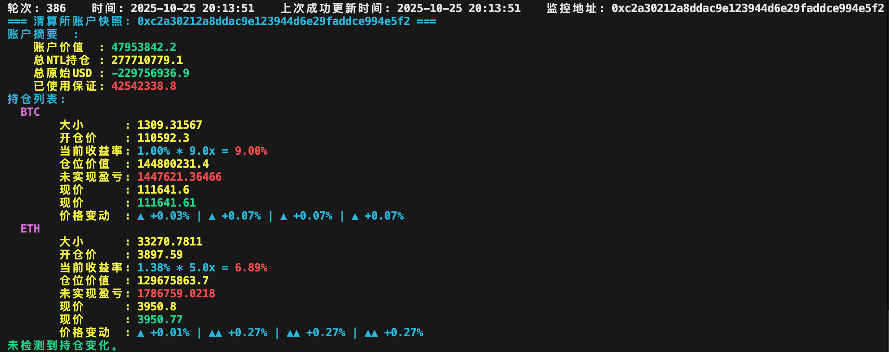

# wallet-tracker

一个用于监控巨鲸账户持仓并在终端友好显示的轻量脚本集合。

本仓库包含用于：
- 周期性拉取账户状态并打印结构化、对齐的中文输出（带颜色高亮），
- 检测持仓变更并通过邮件发送通知，
- 查询 Binance 公共接口以显示现价与短期价格变动，

## 功能概览
- 定时（默认 30 秒）拉取清算所账户状态并在终端以中文输出：账户摘要、每个持仓的大小/开仓价/当前 ROI/仓位价值/未实现盈亏等。
- 侦测持仓的新增/平仓/变动，在变更时构建邮件正文并发送到配置的收件箱


## 依赖
- Python 3.8+
- requests
- colorama

建议把依赖写入 `requirements.txt` 并通过 `pip install -r requirements.txt` 安装。


## 快速开始（本地运行）
1. 克隆仓库并进入项目根目录：

```bash
git clone <repo>
cd wallet-tracker
```

2. 安装依赖：

```bash
pip install requests colorama
```

3. 配置（两种方式）：
- 直接编辑 `tracker.py` 顶部常量：RPC_API、TARGET（要监控的地址）、SMTP_HOST/SMTP_PORT/SMTP_USER/SMTP_PASS/EMAIL_FROM/EMAIL_TO、POLL_INTERVAL 等。
- 或使用环境变量覆盖（推荐生产使用环境变量以保护凭据）：
  - RPC_API
  - TARGET_ADDRESS
  - POLL_INTERVAL
  - SMTP_HOST, SMTP_PORT, SMTP_USER, SMTP_PASS, EMAIL_FROM, EMAIL_TO

> 注意：163 邮箱需使用 SMTP 授权码（不是登录密码）。不要把真实授权码提交到公共仓库。

4. 运行监控脚本：

```bash
python3 tracker.py
```

脚本将持续轮询并在终端打印输出。按 Ctrl+C 停止。

运行示例：

```bash
python3 show_leaders.py
```



## 配置要点与可调整项
- `TARGET`/`TARGET_ADDRESS`：要监控的账户地址（小写/校验请自行确认）。
- `POLL_INTERVAL`：轮询间隔（秒）。
- 邮件通知配置：SMTP_* 常量或同名环境变量。
- Binance 访问保护：脚本内部有 `TICKER_TTL`、`BINANCE_BAN_UNTIL` 等参数，用于控制缓存与被封后的保护逻辑。


## 常见故障与排查建议
- 422 Unprocessable Entity（RPC）:
  - 说明 RPC 请求体中某个字段不被服务接受（例如地址格式或其他缺失字段）。
  - 建议：先在浏览器或 curl 中复现请求，或在本地打印 `resp.text` / JSON 来查看服务返回的错误详情。

- Binance 限流 / 被封（HTTP 418 或 API code -1003）:
  - 脚本会在检测到 -1003 时解析返回中带的解封时间并在该期间减少对 Binance 的请求。
  - 若频繁触发，减少并发请求、增大 `TICKER_TTL` 或延长 `POLL_INTERVAL`。

- 邮件发送失败：
  - 检查 SMTP_HOST/PORT 是否正确，确认是否需要 SSL（默认代码使用 SSL，SMTP_USE_SSL）。
  - 对于 163 邮箱，请使用 SMTP 授权码并确保开启 SMTP 服务。

## 许可证
见项目根目录 `LICENSE`。
